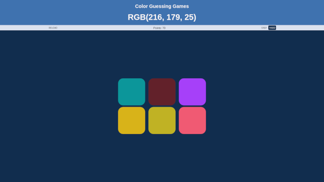

# Calculator JS

This is a color guessing web project made in pure JavaScript.

## 🔨 Project features

This is a web game with the goal is to try to guess the color by the RGB code, with easy and difficult mode.
## ✔️ techniques and technologies used 

- `HTML`: HTML serves as a page structuring
- `CSS`: The CSS gives a more beautiful and modern look.
- `JavaScript`: JavaScript implements the operations, display, cleaning button and other details.
  - `querySelector`;
  - `document`;
  - `const`;
  - `let`;
  - `function`;
  - `if`;
  - `event List`;
  - `forEach`;
  - `array`;
  - `DOM`;

## 📁 Access to the project

[See the final project of the course in operation](https://eierick.github.io/color-game).

## 🛠️ Open and run the project
To open and run the project, just open the `index.html` file in the browser.
